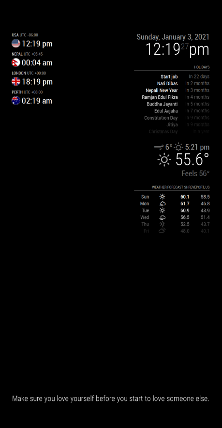

# MagicMirror² Wise Quotes module
This is a module for `MagicMirror²`.
NOTE: It is a beta mode (test mode). Works still under progress are:
1. Styling of the module and text. 

## Installation
1.  Clone this repository into your MagicMirror `modules` folder.
2.  Edit your configuration file under `config/config.js` with the following configuration.
```
{
    module: 'MMM-WiseQuotes',
    position: 'bottom_bar',
    config: {
        fetchInterval: 10000
    }
}
```

### Preview



## Configuration options

| Option                 | Description
|------------------------|-----------
| `fetchInterval`| How often (in milliseconds) a new quote should be fetched.<br><br> **Type:** `number` <br>**Default value:** `10000`